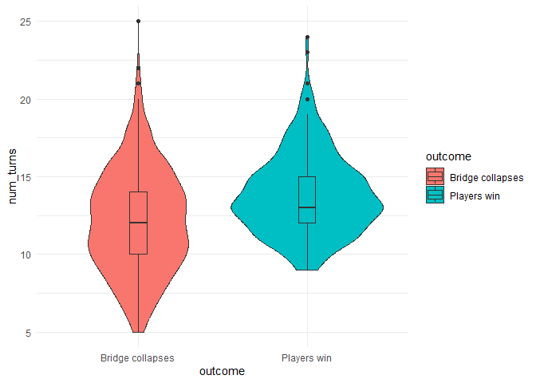

<!-- README.md is generated from README.Rmd. Please edit that file -->

# Little cooperation simulation

The goal of little_cooperation is to simulate the game “little
cooperation” to analyze the probability of winning.

Inspired on
<https://github.com/kjytay/misc/blob/master/blog/2021-01-05%20first_orchard.R>

## Game simulation

``` r
simulate_game(verbose = TRUE) |> knitr::kable()
#> Roll: bridge , State: 3,1,6
#> Roll: bridge , State: 2,2,6
#> Roll: pillar , State: 2,2,5
#> Roll: pillar , State: 2,2,4
#> Roll: home , State: 2,1,4
#> Roll: bridge , State: 1,2,4
#> Roll: home , State: 1,1,4
#> Roll: pillar , State: 1,1,3
#> Roll: pillar , State: 1,1,2
#> Roll: bridge , State: 0,2,2
#> Roll: bridge , State: 0,2,2
#> Roll: bridge , State: 0,2,2
#> Roll: bridge , State: 0,2,2
#> Roll: home , State: 0,1,2
#> Roll: bridge , State: 0,1,2
#> Roll: pillar , State: 0,1,1
#> Bridge collapses
#> # of turns: 16
```

| outcome | num_turns | start | bridge | home | pillars |
|--------:|----------:|------:|-------:|-----:|--------:|
|       2 |        16 |     0 |      1 |    3 |       1 |

``` r

# Number of simulations
nsim <- 1000

# Simulate the game and save the results in a tibble
result <- purrr::map_dfr(1:nsim, ~ simulate_game(verbose = FALSE))

cat("Probability of winning:", sum(result$outcome == 1)/nsim * 100, "%\n")
#> Probability of winning: 36.1 %

cat("Average of turns:", mean(result$num_turns))
#> Average of turns: 12.731
```

## Number of remaining pillars when players win

``` r

# number of pillars remaining when players win
result |>
  filter(outcome == 1) |>
  ggplot(aes(x = pillars))+
  geom_density(fill = "lightblue")
```

<!-- -->

## Number of turns compared to the outcome:

``` r
result |>
  mutate(outcome = if_else(outcome == 1, "Players win", "Bridge collapses")) |>
  ggplot(aes(x = outcome, y = num_turns, fill=outcome))+
  geom_violin()+
  geom_boxplot(width = 0.1)
```

<!-- -->

## 

``` r
result |>
  filter(outcome == 2) |>
  pivot_longer(3:5) |>
  mutate(name = factor(name, levels = c("start", "bridge", "home"))) |> 
  ggplot(aes(x=name, y=value, fill = name))+
  geom_violin(show.legend = F)
```

<!-- -->
